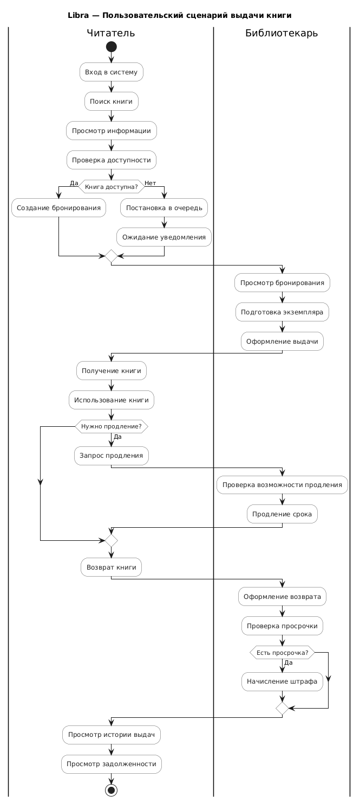
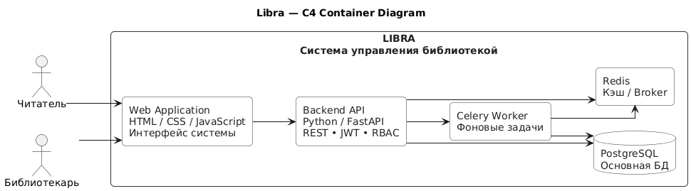
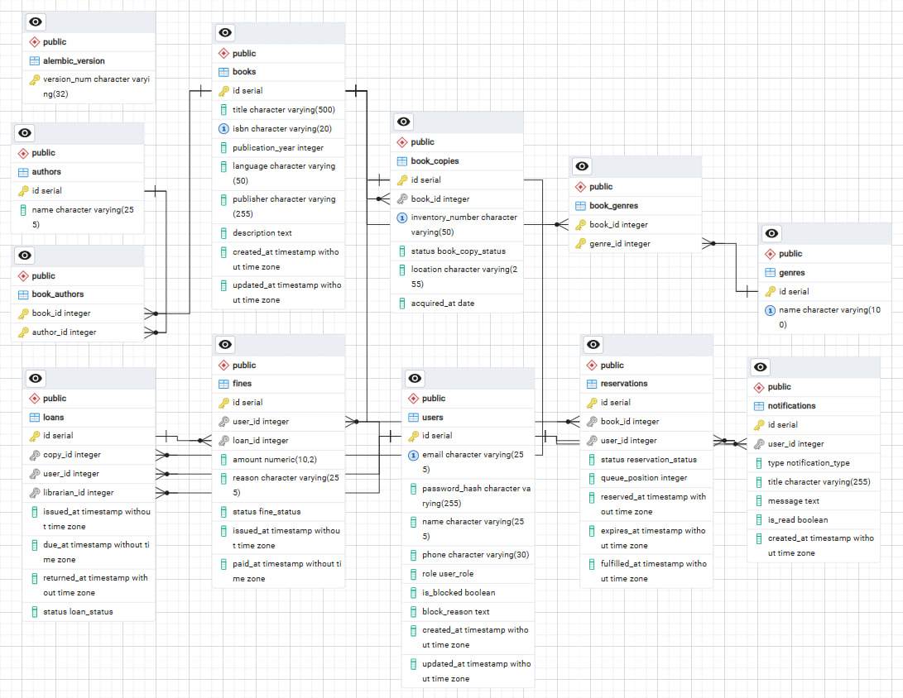

# Архитектура серверного приложения Libra

## 1. Use Cases

### Назначение системы

Libra — веб-приложение для автоматизации работы физической библиотеки.

Система предназначена для ведения каталога книг и физических экземпляров, управления читателями, оформления выдачи и возврата книг, бронирования экземпляров, формирования очереди, контроля сроков возврата и учёта штрафов.

Для выполнения задания рассмотрены две основные роли: **читатель** и **библиотекарь**.

---

### Роль «Читатель»

|                       | Описание                                                                                                                                                                                                                                                      |
| --------------------- | ------------------------------------------------------------------------------------------------------------------------------------------------------------------------------------------------------------------------------------------------------------- |
| **Актор**             | Читатель                                                                                                                                                                                                                                                      |
| **Основные действия** | Регистрация и авторизация; управление профилем; просмотр и поиск книг; фильтрация каталога; просмотр доступности экземпляров; бронирование; постановка в очередь; получение и возврат книг; продление срока; просмотр истории выдач, задолженностей и штрафов |

**Сценарии использования:**

| Use Case                    | Описание                                                                     |
| --------------------------- | ---------------------------------------------------------------------------- |
| Регистрация                 | Создание учётной записи читателя                                             |
| Авторизация                 | Вход в систему с использованием учётных данных                               |
| Просмотр профиля            | Просмотр и изменение личных данных                                           |
| Просмотр каталога           | Просмотр книг, представленных в библиотеке                                   |
| Поиск книги                 | Поиск книги по названию, автору или ISBN                                     |
| Фильтрация книг             | Фильтрация книг по жанру, году издания и языку                               |
| Просмотр информации о книге | Просмотр библиографической информации и списка физических экземпляров        |
| Просмотр доступности        | Проверка наличия свободных экземпляров книги                                 |
| Бронирование книги          | Создание бронирования доступной книги                                        |
| Постановка в очередь        | Добавление читателя в очередь, если все экземпляры книги заняты              |
| Получение книги             | Получение забронированного или доступного экземпляра                         |
| Возврат книги               | Возврат ранее выданного физического экземпляра                               |
| Продление срока             | Запрос на продление срока пользования книгой                                 |
| Просмотр истории выдач      | Просмотр списка ранее выданных и возвращённых книг                           |
| Просмотр задолженностей     | Просмотр текущих выдач и просроченных книг                                   |
| Просмотр штрафов            | Просмотр начисленных штрафов                                                 |
| Получение уведомлений       | Получение уведомлений о приближении срока возврата и готовности бронирования |

---

### Роль «Библиотекарь»

|                       | Описание                                                                                                                                                                                              |
| --------------------- | ----------------------------------------------------------------------------------------------------------------------------------------------------------------------------------------------------- |
| **Актор**             | Библиотекарь                                                                                                                                                                                          |
| **Основные действия** | Управление каталогом и физическими экземплярами; оформление выдачи и возврата; управление бронированиями и очередью; контроль просроченных книг и штрафов; управление читателями; просмотр статистики |

**Сценарии использования:**

| Use Case                     | Описание                                                               |
| ---------------------------- | ---------------------------------------------------------------------- |
| Авторизация                  | Вход в систему с правами библиотекаря                                  |
| Управление книгами           | Добавление, изменение и удаление информации о книгах                   |
| Управление авторами          | Добавление и изменение информации об авторах                           |
| Управление жанрами           | Добавление, изменение и удаление жанров                                |
| Управление экземплярами      | Добавление и изменение физических экземпляров книг                     |
| Изменение статуса экземпляра | Изменение состояния экземпляра, например доступен, выдан или повреждён |
| Оформление выдачи            | Выдача физического экземпляра читателю                                 |
| Оформление возврата          | Регистрация возврата физического экземпляра                            |
| Продление срока              | Продление срока пользования книгой                                     |
| Управление бронированиями    | Просмотр и обработка активных бронирований                             |
| Управление очередью          | Просмотр и обработка очереди читателей                                 |
| Контроль просрочек           | Просмотр книг с истёкшим сроком возврата                               |
| Управление штрафами          | Начисление и изменение статуса штрафов                                 |
| Управление читателями        | Просмотр и изменение данных читателей                                  |
| Блокировка пользователя      | Блокировка читателя при выполнении установленных условий               |
| Разблокировка пользователя   | Снятие блокировки с читателя                                           |
| Просмотр статистики          | Просмотр статистики по книгам, экземплярам, выдачам и читателям        |

---

### Разграничение доступа

В системе используется **RBAC (Role-Based Access Control)** — управление доступом на основе ролей.

В Libra предусмотрены две основные роли:

- `READER` — читатель;
- `LIBRARIAN` — библиотекарь.

Права пользователей разграничиваются следующим образом:

| Возможность                  | READER | LIBRARIAN |
| ---------------------------- | :----: | :-------: |
| Просмотр каталога            |   ✓    |     ✓     |
| Поиск книг                   |   ✓    |     ✓     |
| Фильтрация книг              |   ✓    |     ✓     |
| Просмотр экземпляров         |   ✓    |     ✓     |
| Создание бронирования        |   ✓    |     —     |
| Постановка в очередь         |   ✓    |     —     |
| Просмотр собственных выдач   |   ✓    |     —     |
| Просмотр собственных штрафов |   ✓    |     —     |
| Управление книгами           |   —    |     ✓     |
| Управление экземплярами      |   —    |     ✓     |
| Оформление выдачи            |   —    |     ✓     |
| Оформление возврата          |   —    |     ✓     |
| Управление бронированиями    |   —    |     ✓     |
| Управление очередью          |   —    |     ✓     |
| Управление читателями        |   —    |     ✓     |
| Блокировка пользователей     |   —    |     ✓     |
| Просмотр статистики          |   —    |     ✓     |

Аутентификация пользователей осуществляется с использованием **JWT (JSON Web Token)**.

---

### Диаграмма Use Case

_Рис. 1. Диаграмма вариантов использования системы Libra_

Исходник PlantUML: [user_cases.puml](user_cases.puml)

---

## 2. Ключевые сущности

В базе данных Libra выделены следующие основные сущности:

| Сущность        | Таблица         | Назначение                                    | Основные данные                                                                               |
| --------------- | --------------- | --------------------------------------------- | --------------------------------------------------------------------------------------------- |
| Пользователь    | `users`         | Хранение читателей и библиотекарей            | id, email, password_hash, name, phone, role, is_blocked, block_reason, created_at, updated_at |
| Книга           | `books`         | Хранение библиографической информации         | id, title, isbn, publication_year, language, publisher, description, created_at, updated_at   |
| Автор           | `authors`       | Справочник авторов                            | id, name                                                                                      |
| Книга–автор     | `book_authors`  | Связь книг и авторов                          | book_id, author_id                                                                            |
| Жанр            | `genres`        | Справочник жанров                             | id, name                                                                                      |
| Книга–жанр      | `book_genres`   | Связь книг и жанров                           | book_id, genre_id                                                                             |
| Экземпляр книги | `book_copies`   | Учёт физических экземпляров книг              | id, book_id, inventory_number, status, location, acquired_at                                  |
| Бронирование    | `reservations`  | Бронирование книг и управление очередью       | id, book_id, user_id, status, queue_position, reserved_at, expires_at, fulfilled_at           |
| Выдача          | `loans`         | Учёт выдачи и возврата физических экземпляров | id, copy_id, user_id, librarian_id, issued_at, due_at, returned_at, status                    |
| Штраф           | `fines`         | Учёт штрафов за просрочку                     | id, user_id, loan_id, amount, reason, status, issued_at, paid_at                              |
| Уведомление     | `notifications` | Хранение уведомлений пользователей            | id, user_id, type, title, message, is_read, created_at                                        |

---

## 3. C4 Container Diagram

Система Libra построена по **клиент-серверной архитектуре**.

### Основные контейнеры

| Контейнер             | Технология            | Назначение                                                                            |
| --------------------- | --------------------- | ------------------------------------------------------------------------------------- |
| **Web Application**   | HTML, CSS, JavaScript | Пользовательский интерфейс читателя и библиотекаря                                    |
| **Backend API**       | Python, FastAPI       | REST API, бизнес-логика, JWT-аутентификация и RBAC                                    |
| **Database**          | PostgreSQL            | Хранение пользователей, книг, экземпляров, выдач, бронирований, штрафов и уведомлений |
| **Redis**             | Redis                 | Кэширование данных и передача фоновых задач                                           |
| **Background Worker** | Python, Celery        | Выполнение фоновых задач, проверка сроков возврата и формирование уведомлений         |

### Взаимодействие

- Пользователь работает с системой через веб-интерфейс (Web Application).
- Клиент отправляет запросы к Backend API через REST API.
- Backend API выполняет бизнес-логику, проверяет права доступа (RBAC) и взаимодействует с PostgreSQL.
- Redis используется для кэширования и как брокер сообщений для Celery.
- Background Worker (Celery) выполняет фоновые задачи: контроль сроков возврата, формирование уведомлений и обновление статусов.

### Диаграмма

_Рис. 2. C4-диаграмма для веб-приложения «Libra»_

Исходник PlantUML: [c4.puml](c4.puml)

---

## 4. ER-диаграмма

### Таблица `users`

Таблица `users` является центральной сущностью системы. В ней хранятся учётные записи читателей и библиотекарей.

| Поле          | Тип          | Назначение                    |
| ------------- | ------------ | ----------------------------- |
| id            | BIGSERIAL    | PK                            |
| email         | VARCHAR(255) | Электронная почта, **UNIQUE** |
| password_hash | VARCHAR(255) | Хеш пароля                    |
| name          | VARCHAR(255) | Имя пользователя              |
| phone         | VARCHAR(30)  | Номер телефона                |
| role          | VARCHAR(20)  | Роль пользователя             |
| is_blocked    | BOOLEAN      | Признак блокировки            |
| block_reason  | TEXT         | Причина блокировки            |
| created_at    | TIMESTAMP    | Дата создания                 |
| updated_at    | TIMESTAMP    | Дата изменения                |

Допустимые роли:

- `READER`
- `LIBRARIAN`

### Таблица `books`

Таблица `books` содержит библиографическую информацию о книгах.

| Поле             | Тип          | Назначение       |
| ---------------- | ------------ | ---------------- |
| id               | BIGSERIAL    | PK               |
| title            | VARCHAR(500) | Название книги   |
| isbn             | VARCHAR(20)  | ISBN, **UNIQUE** |
| publication_year | INT          | Год издания      |
| language         | VARCHAR(50)  | Язык книги       |
| publisher        | VARCHAR(255) | Издательство     |
| description      | TEXT         | Описание книги   |
| created_at       | TIMESTAMP    | Дата создания    |
| updated_at       | TIMESTAMP    | Дата изменения   |

ISBN используется для идентификации конкретного издания книги.

### Таблица `authors`

Таблица `authors` содержит справочник авторов.

| Поле | Тип          | Назначение |
| ---- | ------------ | ---------- |
| id   | BIGSERIAL    | PK         |
| name | VARCHAR(255) | Имя автора |

### Таблица `book_authors`

Таблица `book_authors` реализует связь между книгами и авторами.

| Поле      | Тип    | Назначение      |
| --------- | ------ | --------------- |
| book_id   | BIGINT | FK → books.id   |
| author_id | BIGINT | FK → authors.id |

Первичный ключ: `(book_id, author_id)`

Одна книга может иметь нескольких авторов, а один автор может быть связан с несколькими книгами.  
Таким образом, связь `books` и `authors` является **N:M**.

### Таблица `genres`

Таблица `genres` содержит справочник жанров.

| Поле | Тип          | Назначение                 |
| ---- | ------------ | -------------------------- |
| id   | BIGSERIAL    | PK                         |
| name | VARCHAR(100) | Название жанра, **UNIQUE** |

### Таблица `book_genres`

Таблица `book_genres` реализует связь между книгами и жанрами.

| Поле     | Тип    | Назначение     |
| -------- | ------ | -------------- |
| book_id  | BIGINT | FK → books.id  |
| genre_id | BIGINT | FK → genres.id |

Первичный ключ: `(book_id, genre_id)`

Одна книга может относиться к нескольким жанрам, а один жанр может содержать множество книг.  
Таким образом, связь `books` и `genres` является **N:M**.

### Таблица `book_copies`

Таблица `book_copies` предназначена для учёта физических экземпляров книг.

| Поле             | Тип          | Назначение                    |
| ---------------- | ------------ | ----------------------------- |
| id               | BIGSERIAL    | PK                            |
| book_id          | BIGINT       | FK → books.id                 |
| inventory_number | VARCHAR(50)  | Инвентарный номер, **UNIQUE** |
| status           | VARCHAR(30)  | Состояние экземпляра          |
| location         | VARCHAR(255) | Место хранения                |
| acquired_at      | DATE         | Дата поступления              |

Возможные статусы:

- `AVAILABLE` — экземпляр доступен для выдачи
- `RESERVED` — экземпляр закреплён за бронированием
- `BORROWED` — экземпляр находится у читателя
- `LOST` — экземпляр утерян
- `DAMAGED` — экземпляр повреждён

### Таблица `reservations`

Таблица `reservations` содержит информацию о бронированиях книг и очереди читателей.

| Поле           | Тип         | Назначение                   |
| -------------- | ----------- | ---------------------------- |
| id             | BIGSERIAL   | PK                           |
| book_id        | BIGINT      | FK → books.id                |
| user_id        | BIGINT      | FK → users.id                |
| status         | VARCHAR(30) | Статус бронирования          |
| queue_position | INT         | Позиция в очереди            |
| reserved_at    | TIMESTAMP   | Дата создания бронирования   |
| expires_at     | TIMESTAMP   | Срок действия бронирования   |
| fulfilled_at   | TIMESTAMP   | Дата выполнения бронирования |

Возможные статусы:

- `WAITING` — читатель находится в очереди
- `READY` — книга доступна и подготовлена для читателя
- `FULFILLED` — бронирование выполнено
- `CANCELLED` — бронирование отменено
- `EXPIRED` — срок действия бронирования истёк

Если все экземпляры книги заняты, новый читатель может быть добавлен в очередь.

### Таблица `loans`

Таблица `loans` предназначена для учёта выдачи и возврата физических экземпляров.

| Поле         | Тип         | Назначение                |
| ------------ | ----------- | ------------------------- |
| id           | BIGSERIAL   | PK                        |
| copy_id      | BIGINT      | FK → book_copies.id       |
| user_id      | BIGINT      | FK → users.id             |
| librarian_id | BIGINT      | FK → users.id             |
| issued_at    | TIMESTAMP   | Дата выдачи               |
| due_at       | TIMESTAMP   | Срок возврата             |
| returned_at  | TIMESTAMP   | Фактическая дата возврата |
| status       | VARCHAR(30) | Статус выдачи             |

Возможные статусы:

- `ACTIVE`
- `RETURNED`
- `OVERDUE`

`user_id` указывает на читателя.  
`copy_id` указывает на конкретный физический экземпляр книги.  
`librarian_id` указывает на библиотекаря, который оформил выдачу.

### Таблица `fines`

Таблица `fines` предназначена для учёта штрафов.

| Поле      | Тип           | Назначение         |
| --------- | ------------- | ------------------ |
| id        | BIGSERIAL     | PK                 |
| user_id   | BIGINT        | FK → users.id      |
| loan_id   | BIGINT        | FK → loans.id      |
| amount    | NUMERIC(10,2) | Размер штрафа      |
| reason    | VARCHAR(255)  | Причина начисления |
| status    | VARCHAR(30)   | Статус штрафа      |
| issued_at | TIMESTAMP     | Дата начисления    |
| paid_at   | TIMESTAMP     | Дата погашения     |

Возможные статусы:

- `UNPAID`
- `PAID`
- `CANCELLED`

Основным случаем начисления штрафа является нарушение срока возврата книги.

### Таблица `notifications`

Таблица `notifications` хранит уведомления пользователей.

| Поле       | Тип          | Назначение        |
| ---------- | ------------ | ----------------- |
| id         | BIGSERIAL    | PK                |
| user_id    | BIGINT       | FK → users.id     |
| type       | VARCHAR(50)  | Тип уведомления   |
| title      | VARCHAR(255) | Заголовок         |
| message    | TEXT         | Текст уведомления |
| is_read    | BOOLEAN      | Признак прочтения |
| created_at | TIMESTAMP    | Дата создания     |

Примеры типов уведомлений:

- `DUE_DATE_APPROACHING`
- `BOOK_READY`
- `RESERVATION_EXPIRED`
- `OVERDUE`

### Связи между таблицами

| Связь                                | Тип |
| ------------------------------------ | --- |
| users → reservations                 | 1:N |
| books → reservations                 | 1:N |
| books → book_copies                  | 1:N |
| books ↔ authors через `book_authors` | N:M |
| books ↔ genres через `book_genres`   | N:M |
| users → loans                        | 1:N |
| users → loans через `librarian_id`   | 1:N |
| book_copies → loans                  | 1:N |
| users → fines                        | 1:N |
| loans → fines                        | 1:N |
| users → notifications                | 1:N |

### Нормализация (1НФ, 2НФ, 3НФ)

**Первая нормальная форма (1НФ)**

Все атрибуты таблиц являются атомарными и не содержат повторяющихся групп.

Повторяющиеся и многозначные данные вынесены в отдельные таблицы:

- авторы — `authors`;
- жанры — `genres`;
- физические экземпляры — `book_copies`;
- бронирования — `reservations`;
- выдачи — `loans`;
- штрафы — `fines`;
- уведомления — `notifications`.

Связи N:M реализованы через промежуточные таблицы:

- `book_authors`;
- `book_genres`.

**Вторая нормальная форма (2НФ)**

Каждый неключевой атрибут полностью зависит от первичного ключа.

В таблицах `book_authors` и `book_genres` используются составные первичные ключи:

- `(book_id, author_id)`
- `(book_id, genre_id)`

В этих таблицах отсутствуют атрибуты, зависящие только от одной части составного ключа.

**Третья нормальная форма (3НФ)**

Транзитивные зависимости между неключевыми атрибутами отсутствуют.

Например:

- библиографические данные хранятся в `books`;
- данные об авторах хранятся в `authors`;
- данные о жанрах хранятся в `genres`;
- данные физических экземпляров хранятся в `book_copies`;
- данные выдач хранятся в `loans`;
- данные штрафов хранятся в `fines`.

Это уменьшает дублирование данных и позволяет изменять информацию в одном месте.

### Ограничения целостности

**PRIMARY KEY**

- Для основных таблиц используется первичный ключ `id`.
- Для промежуточных таблиц используются составные первичные ключи:
  - `book_authors (book_id, author_id)`
  - `book_genres (book_id, genre_id)`

**FOREIGN KEY**

Внешние ключи обеспечивают ссылочную целостность:

- `book_authors.book_id` → `books.id`
- `book_authors.author_id` → `authors.id`
- `book_genres.book_id` → `books.id`
- `book_genres.genre_id` → `genres.id`
- `book_copies.book_id` → `books.id`
- `reservations.book_id` → `books.id`
- `reservations.user_id` → `users.id`
- `loans.copy_id` → `book_copies.id`
- `loans.user_id` → `users.id`
- `loans.librarian_id` → `users.id`
- `fines.user_id` → `users.id`
- `fines.loan_id` → `loans.id`
- `notifications.user_id` → `users.id`

**UNIQUE**

Уникальность должна обеспечиваться для:

- `users.email`
- `books.isbn`
- `genres.name`
- `book_copies.inventory_number`

ISBN может быть `NULL`, если для конкретного издания ISBN отсутствует.  
Инвентарный номер физического экземпляра должен быть уникальным.

**CHECK**

- `fines.amount >= 0`
- `publication_year > 0`
- `queue_position > 0`

Для других числовых значений используются ограничения, предотвращающие недопустимые отрицательные значения.

### Бизнес-ограничения

Система должна обеспечивать следующие правила:

- заблокированный пользователь не может создавать новые бронирования;
- заблокированный пользователь не может получать новые книги;
- один физический экземпляр не может одновременно находиться в нескольких активных выдачах;
- выдать можно только доступный экземпляр;
- экземпляр со статусом `LOST` или `DAMAGED` не может быть выдан;
- вернуть можно только экземпляр, находящийся в активной выдаче;
- продление возможно только для активной выдачи;
- бронирование может быть создано только зарегистрированным пользователем;
- позиция читателя в очереди должна быть положительной;
- после возврата экземпляра следующий читатель очереди может получить статус `READY`;
- при наступлении установленного срока система должна контролировать состояние выдачи;
- при возникновении просрочки выдача переводится в соответствующее состояние;
- при просрочке может быть сформирован штраф;
- уведомление о приближении срока возврата создаётся автоматически фоновой задачей;
- после выполнения бронирования его статус изменяется на `FULFILLED`.

### Диаграмма

_Рис. 3. База данных для веб-приложения «Libra»_

---

## 5. Основные технологии Backend

Серверная часть Libra реализуется на **Python** с использованием **FastAPI**.

| Технология     | Назначение                                    |
| -------------- | --------------------------------------------- |
| **FastAPI**    | REST API, асинхронная обработка запросов      |
| **PostgreSQL** | Основная реляционная база данных              |
| **SQLAlchemy** | ORM для работы с PostgreSQL                   |
| **Alembic**    | Миграции схемы базы данных                    |
| **Pydantic**   | Валидация данных и схемы запросов/ответов     |
| **JWT**        | Аутентификация и авторизация                  |
| **RBAC**       | Разграничение доступа на основе ролей         |
| **Redis**      | Кэширование и брокер сообщений                |
| **Celery**     | Фоновые задачи (проверка сроков, уведомления) |
| **Docker**     | Контейнеризация приложения и инфраструктуры   |
| **Pytest**     | Модульное и интеграционное тестирование       |
